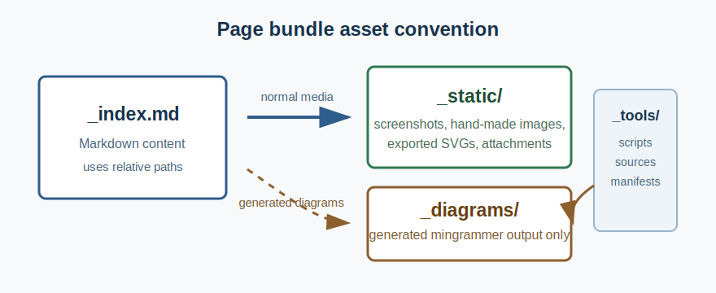

## Purpose

This page demonstrates the default asset convention for new content: page-bundled media with relative Markdown paths.

## Page-Bundled Static Asset

The image below lives next to this page under `_static/`.



## Recommended Pattern

Use this structure for page-specific media:

```text
content/02-authoring-assets/
  _index.md
  _index.vi.md
  _static/
    page-bundle-example.svg
```

Then reference the asset with a relative path:

```markdown

```

Avoid root-relative `/images/...` paths in new content. They are supported only for legacy compatibility.
